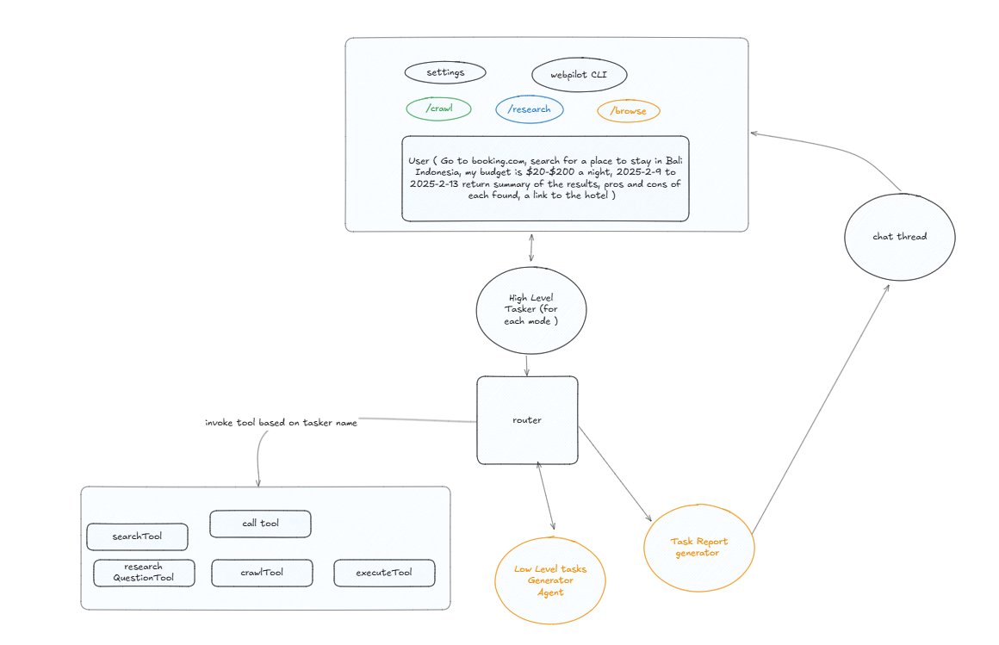

# Next-Generation Research CLI Tool Design Document

**Version:** 1.0  
**Date:** 2025-02-04  
**Author:** Ahmed Rakan

## 1. Introduction

The Next-Generation Research CLI Tool is designed to empower researchers by providing a powerful, flexible, and extensible command-line interface to access, query, and analyze academic literature and research data. The tool integrates with various data sources, APIs, and processing engines, offering a seamless experience for executing research queries, aggregating data, and generating insights—all directly from the command line.

---

## 2. Objectives and Scope

### Objectives

- **Efficiency:** Provide fast access to multiple research data sources.
- **Flexibility:** Support a variety of research tasks including data querying, processing, and reporting.
- **Extensibility:** Allow easy integration of new data sources and analytical plugins.
- **User Experience:** Offer a rich and intuitive CLI experience with robust command parsing and auto-completion features.

### Scope

- Integration with database for tasks presistance.
- Support for API-based data retrieval.
- Integration with local browser both headless for crawling, and headful for browser tasks.
- Output are formated and reported to the user per task.
- Each chat has unique title and thread id.

---

## 3. System Architecture Overview

### 3.1 abstract

The architecture of the CLI tool is modular, ensuring separation of concerns and ease of maintenance. The tool can perform three main tasks when user enter command `/research`, `/crawl` or `/browse` :

1. `/research` : The tool integrate with <a href="https://tavily.com/">Tavily</a> search engine, the agent will keep requesting the engine for search result until it have enough information to provide the answer. The number of search results is controlled via enviroment variable called `SEARCH_RESULTS`. This will control how many search results per query the A.I gets. The way to trigger the research functionality is by typing /research at any point of the chat in the CLI tool.

2. `/crawl`: The tool will allow you to crawl websites for specific items. The crawl intensity is controllable via two enviroment variables `CRAWL_PAGE`, `CRAWL_DEPTH`:

- `CRAWL_PAGE`: Controls the number of links fetched from a single url.
- `CRAWL_DEPTH`: Controls the depth of crawling from each link.

e.g. CRAWL_PAGE = 2, CRAWL_DEPTH = 2. This will make the A.I go into the two links crawl the content, fetch two links from go two level inside each link on the page and crawl the result from each.

3. `/browse`: The tool will crawl the website to perform the browser tasks, once the tasks are generated, you will see a brwowser pop up and you will be able to see the Agentic A.I browse for you. The browser for the /browse session will not be clossed until you close it with `/crawl`, `/browse`, `/research` commands.

#

---

## 4. Component Design

### 4.1 CLI Interface and Command Parser

- **Responsibilities:**
  - Accept and parse user inputs.
  - Dispatch commands to the appropriate modules.
  - invoke correct graph based on entered command.
  - generate chat thread id for every command invoked.
- **Technologies:**
  - Langchain, OpenAI
  - NodeJS
- **Key Features:**
  - Command aliasing.
  - Data presistance.
  - Great UI/UX

### 4.2 Searcher Agentic AI

- **Responsibilities and Key Features:**
  - Interpret search queries, including natural language and structured queries.
  - Interface with databases/APIs.
  - Presist search history into database.
  - Prompt to research
  - Create research report.

### 4.3 Crawler Agentic AI

- **Responsibilities and Key Features:**
  - Turn a prompt into crawl task
  - Presist crawled data into database.

### 4.4 Brwosser Agentic AI

- **Responsibilities and Key Features:**
  - Turn prompot into browser tasks.
  - Crawl required items from website.
  - perform browser tasks for the user.

### 4.5 Output Formatter and Reporting

- **Responsibilities and Key Features:**
  - Format and present results in various formats (console, JSON, CSV, PDF).
  - Support configurable verbosity and report templates.
